# Hansken Data Flow & Architecture Hierarchy

This document provides a clean, intentional, and fully verified data flow hierarchy for the Hansken forensic platform. It separates the architecture into logical vertical layers, explains every connection, and cites the official Hansken documentation to guarantee 100% technical accuracy.

---

## 1. Architectural Flow Diagram (Mermaid)

```mermaid
flowchart TD
  %% Style Definitions
  classDef client fill:#E0E0E0,stroke:#888888,stroke-width:1px,color:#000000;
  classDef auth fill:#EEEDFE,stroke:#534AB7,stroke-width:1.5px,color:#000000;
  classDef gateway fill:#E8F5E9,stroke:#0F6E56,stroke-width:1.5px,color:#000000;
  classDef core fill:#9FE1CB,stroke:#0F6E56,stroke-width:1.5px,color:#000000;
  classDef extraction fill:#F5C4B3,stroke:#712B13,stroke-width:1.5px,color:#000000;
  classDef broker fill:#FFF3E0,stroke:#EF9F27,stroke-width:1.5px,color:#000000;
  classDef storage fill:#B5D4F4,stroke:#185FA5,stroke-width:1.5px,color:#000000;

  %% Layer 1: Client
  subgraph Layer_Client ["<b><span> Layer 1: Client Layer </span></b>"]
    HUIB["HUIB / ExpertUI (Browser UI)"]
  end
  class HUIB client;

  %% Layer 2: Authentication & Authorization
  subgraph Layer_Auth ["<b><span> Layer 2: Identity & Access Management </span></b>"]
    Keycloak["Keycloak (OIDC Provider)"]
    OpenLDAP["OpenLDAP (User Directory)"]
    Keystore["Keystore (Key Management)"]
    Preference["Preference Service"]
    
    OpenLDAP <-.->|"User Sync"| Keycloak
  end
  class Keycloak,OpenLDAP,Keystore,Preference auth;

  %% Layer 3: Frontend Gateway
  subgraph Layer_Gateway ["<b><span> Layer 3: REST & gRPC Gateway </span></b>"]
    Gatekeeper["Gatekeeper (REST API)"]
    Lobby["Lobby-service (gRPC Router & Scheduler)"]
    
    Gatekeeper <-->|"1-to-1 gRPC Backend"| Lobby
  end
  class Gatekeeper,Lobby gateway;

  %% Layer 4: Core Services
  subgraph Layer_Core ["<b><span> Layer 4: Hansken Core Services </span></b>"]
    Project["Project-service"]
    Trace["Trace-service"]
    DataSvc["Data-service"]
    Cleaner["Cleaner-service"]
  end
  class Project,Trace,DataSvc,Cleaner core;

  %% Layer 5: Extraction Pipeline
  subgraph Layer_Extraction ["<b><span> Layer 5: Extraction Phase </span></b>"]
    Extraction["Extraction-service"]
    Scaler["Scaler-service"]
    Workers["Extraction Workers (Regular + Retry Pods)"]
    Plugins["Extraction Plugins"]
  end
  class Extraction,Scaler,Workers,Plugins extraction;

  %% Message Brokers & Coordination
  subgraph Layer_Brokers ["<b><span> Message Brokers & Coordination </span></b>"]
    NATS["NATS JetStream (Message Broker)"]
    Zookeeper["Zookeeper"]
    Kafka["Apache Kafka"]
  end
  class NATS,Zookeeper,Kafka broker;

  %% Storage Zone 1: Centralized Storage (no visible title per user request)
  subgraph Zone_Centralized [" "]
    Hadoop["Apache Hadoop (HDFS)"]
    S3["S3 / Object Store"]
  end
  class Hadoop,S3 storage;

  %% Storage Zone 2: Application Storage (no visible title per user request)
  subgraph Zone_AppStorage [" "]
    ES["Elasticsearch"]
    Postgres["PostgreSQL"]
  end
  class ES,Postgres storage;

  %% Invisible rank edges — force storage zones below everything else
  Layer_Brokers ~~~ Zone_Centralized
  Layer_Brokers ~~~ Zone_AppStorage

  subgraph Legend ["<b>Diagram Key</b>"]
    direction TB
    L1[Solid Line] -->|Direct Request| L2[ ]
    L3[Dashed Line] -.->|Background Sync| L4[ ]
    style Legend fill:#fff,stroke:#333,stroke-dasharray: 5 5
    style L1 fill:none,stroke:none
    style L2 fill:none,stroke:none
    style L3 fill:none,stroke:none
    style L4 fill:none,stroke:none
  end

  %% --- FLOW CONNECTIONS ---

  %% Client Inputs
  HUIB -->|"Step 1: User Authentication (HTTPS)"| Keycloak
  HUIB -->|"Step 2: Retrieve Keys & Prefs (HTTPS)"| Keystore
  HUIB -->|"Step 2: Retrieve Keys & Prefs (HTTPS)"| Preference
  HUIB -->|"Step 3: REST Requests (HTTPS)"| Gatekeeper

  %% Gatekeeper & Lobby Routing
  Lobby -->|"gRPC Port 443"| Project
  Lobby -->|"gRPC Port 443"| Trace
  Lobby -->|"gRPC Port 443"| DataSvc
  Lobby -->|"gRPC Port 443"| Cleaner
  Lobby -->|"gRPC Port 443"| Extraction

  %% Extraction Phase Flows
  Extraction -->|"Starts & Configures"| Workers
  Extraction -.->|"Creates Streams"| NATS
  Extraction -.->|"Coordinates Plugins"| Plugins
  
  Workers <-->|"Pulls Traces & Acknowledges"| NATS
  
  Scaler -.->|"Monitors Queue Depth"| NATS
  Scaler -.->|"Scales workers up/down"| Workers

  %% Core Service Backend Store operations -> Application Storage
  Project -->|"CRUD Relational Metadata"| Postgres
  Preference -->|"CRUD Preferences"| Postgres
  Trace -->|"CRUD Traces (Search Indices)"| ES
  
  %% Core Service Backend Store operations -> Centralized Storage
  DataSvc -->|"Fetch Bulk Images"| Hadoop
  DataSvc -->|"Fetch Derived Data"| S3

  %% Extraction Workers Backend Operations -> Centralized Storage
  Workers -->|"Reads Raw Forensic Images"| Hadoop
  Workers -->|"Writes Derived Artifact Data"| S3

  %% Extraction Workers Backend Operations -> Application Storage
  Workers -->|"Generates & Index Traces"| ES

  %% Broker Pipelines
  Trace -->|"Asynchronous Messaging via Kafka"| Kafka
  Kafka -->|"Ingests for Malicious Scanning"| Cleaner
  Zookeeper -.->|"Shared Memory / Coordination"| Extraction
```

---

## 2. Step-by-Step Data Flow Description

1. **User Authentication & Ingress**: 
   An analyst logs into the **HUIB (ExpertUI)**, which authenticates against **Keycloak** (federated with **OpenLDAP**).
2. **REST API Entry**: 
   Subsequent analyst operations send HTTPS requests to the **Gatekeeper REST API**.
3. **Lobby Routing & Scheduling**: 
   The Gatekeeper delegates requests via a 1-to-1 gRPC connection to the **Lobby-service**. The Lobby's `scheduler` orchestrates tasks and routes traffic to the appropriate Core Service or the **Extraction-service**.
4. **Extraction Orchestration**:
   When an ingestion/extraction is triggered, the **Extraction-service**:
   - Creates four streams in **NATS JetStream**: `extraction`, `retry`, `deferred`, and `reports`.
   - Provisions **Extraction Workers** (regular and memory-intensive retry pods).
   - Deploys **Extraction Plugins** into the designated namespace (using Envoy/Istio mesh).
5. **Data Extraction & Derived Write**:
   - The **Extraction Workers** fetch the raw forensic evidence images from **Hadoop HDFS**.
   - Workers execute extraction tools/plugins and write newly derived trace data (e.g. OCR text, parsed metadata) to the **S3 Object Store**.
6. **Autoscaling workers**:
   The **Scaler-service** continuously monitors the backlog (queue depth) of the NATS JetStream queues and horizontally scales the number of regular and retry **Extraction Workers** deployments.
7. **Trace Indexing & Security Scan**:
   - New traces generated by the workers are sent to the **Trace-service** to be indexed in **Elasticsearch** (where traces permanently reside for analyst search).
   - For security, the **Trace-service** queues these traces onto **Apache Kafka**.
   - The **Cleaner-service** consumes the traces from **Kafka** and scans them to isolate and remove any malicious content/malware.

---

## 3. Official Hansken Documentation Citations

Every hierarchy and connectivity decision is verified below against the official Dutch Forensic Institute (NFI) Hansken documentation.

### Citation 1: Gatekeeper & Lobby 1-to-1 Relationship
* **Official URL**: [https://learning.hansken.org/docs/architecture.html#gatekeeper](https://learning.hansken.org/docs/architecture.html#gatekeeper)
* **Document Text**: 
  > "The gatekeeper REST-API is the main entrypoint for almost all Hansken features. It has a 1-to-1 relationship with the lobby-service."
* **Document Text (Lobby)**: 
  > "The Lobby-service can be seen as the GRPC backend of the gatekeeper. It coordinates traffic to the correct services. It also contains a component known as the scheduler, responsible for the lifecycle of all Hansken tasks."

### Citation 2: Core Services Connectivity (gRPC Port 443)
* **Official URL**: [https://learning.hansken.org/docs/architecture.html#hansken-core](https://learning.hansken.org/docs/architecture.html#hansken-core)
* **Document Text**:
  > "The core services of Hansken, built and maintained by NFI-developers is referred to as the core. These services are all connected by GRPC using port 443; you can see the exact connections below. The end-user needs access to three services: the gatekeeper, keystore and preference. These are all exposed over HTTPS to any clients, like HUIB."

### Citation 3: Separation of Keycloak/OpenLDAP & Core Keystore/Preference
* **Official URL**: [https://learning.hansken.org/docs/architecture.html#keycloak-openldap](https://learning.hansken.org/docs/architecture.html#keycloak-openldap)
* **Document Text**:
  > "Keycloak and OpenLDAP are used for authentication and authorization within Hansken. They are both developed and maintained by third parties, but we include them in the Helm Chart by-default."
* **Document Text (Keystore/Preference as Core Services)**:
  > "The Keystore is responsible for CRUD operations on the keys used to encrypt your images."
  > "The Preference service is responsible for CRUD operations on user preferences..."

### Citation 4: Data-service Data Fetching
* **Official URL**: [https://learning.hansken.org/docs/architecture.html#data-service](https://learning.hansken.org/docs/architecture.html#data-service)
* **Document Text**:
  > "The Data-service is responsible for most operations to do with fetching data from Hadoop or S3."

### Citation 5: Trace-service & Elasticsearch
* **Official URL**: [https://learning.hansken.org/docs/architecture.html#trace-service](https://learning.hansken.org/docs/architecture.html#trace-service)
* **Document Text**:
  > "The Trace-service is responsible for CRUD operations on traces generated by Hansken, and stored in Elasticsearch."

### Citation 6: Project-service & Postgresql
* **Official URL**: [https://learning.hansken.org/docs/architecture.html#project-service](https://learning.hansken.org/docs/architecture.html#project-service)
* **Document Text**:
  > "The Project-service is responsible for CRUD operations on projects, stored in Postgresql."
* **Document Text (Postgresql description)**:
  > "Postgresql is used to store stateful data of the connected services. So, for instance, it stores user preferences and project metadata."

### Citation 7: Asynchronous Security Scanning via Kafka
* **Official URL**: [https://learning.hansken.org/docs/architecture.html#apache-kafka](https://learning.hansken.org/docs/architecture.html#apache-kafka)
* **Document Text**:
  > "Apache Kafka is used to send messages between one service to the other. As an example, the traces that need to be cleaned are sent by the trace-service trough kafka to the cleaner."

### Citation 8: NATS JetStream Streams and Worker Pods Creation
* **Official URL**: [https://learning.hansken.org/docs/guides/streaming-extraction.html](https://learning.hansken.org/docs/guides/streaming-extraction.html)
* **Document Text**:
  > "The extraction service will create for each started extraction:
  > - Four streams in Nats: extraction, retry, deferred, reports
  > - Two deployments: a regular worker and a retry worker (which contains more memory)
  > - One secret: for the settings (can include passwords) and certificates"

### Citation 9: Auto scaling Workers by Scaler-service
* **Official URL**: [https://learning.hansken.org/docs/guides/streaming-extraction.html#autoscaling](https://learning.hansken.org/docs/guides/streaming-extraction.html#autoscaling)
* **Document Text**:
  > "By default, workers of a streaming extraction are scaled up or down depending on the number of unprocessed messages in the extraction queue(s). Auto scaling is implemented by Scaler service."

### Citation 10: Derived Trace Storage in S3 & Raw Images in Hadoop
* **Official URL**: [https://learning.hansken.org/docs/architecture.html#s3](https://learning.hansken.org/docs/architecture.html#s3)
* **Document Text (S3)**:
  > "In Hansken it is used to store derived trace data, e.g. text extracted from an image using OCR, or text extracted from HTML."
* **Document Text (Hadoop)**:
  > "Apache Hadoop stores your images that are used as input for the extraction-proces. For this we use the HDFS file system..."
